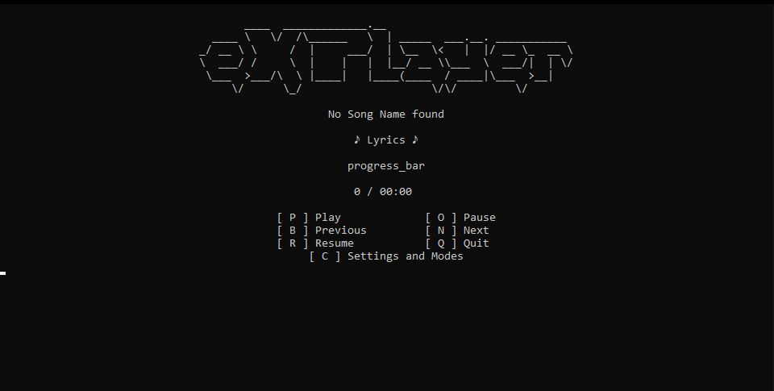
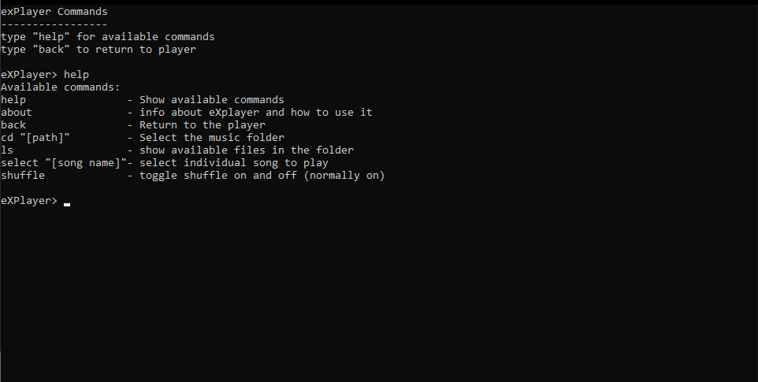
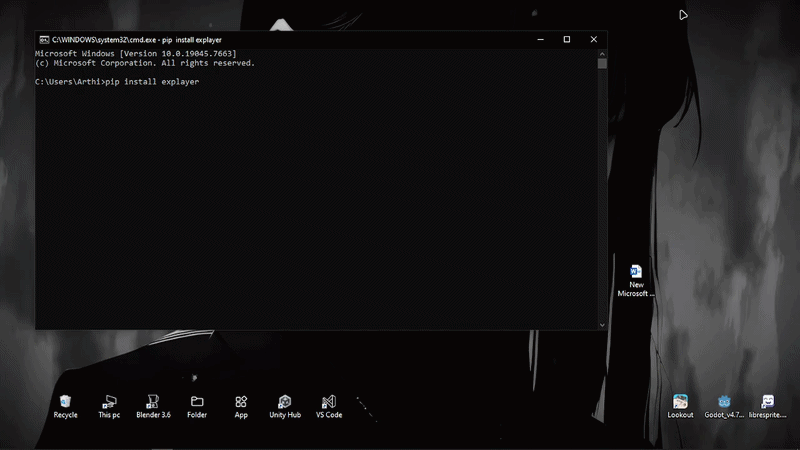

# eXPlayer

**Platform:** eXPlayer currently supports **Windows only**.

eXPlayer is a terminal based music player with lyrics support. The player includes a command window to change settings and other functions!

# Installing

```bash
pip install explayer 
```
to install eXPlayer. You need to have python 3.11 or later to install and run it!

# How to use it? 
After using the command to install it simply run

```bash
explayer
```

it will open the player window, now you need to set the directory or music folder. press [c] on your keyboard to open the command window from there you can set the music folder using command:

```bash
cd "[music folder path]"
```
and head back to the player with
```bash
back
```
And now just simply press [p] to play the songs in shuffle!

run the command
```bash
help
```
to learn about more commands!

# Screenshot and videos

 



# Usage of AI in thi project
Just Gpt is used in this project mainly to fix bugs. Though i did not fully copy gpts code i did write the snippets it gave me. It was used in making the lyrics function, config.json saving and loading function, playing next and previous song function, shuffle function, centering the logo. Other places i use it to help me fix bugs like 2 songs skipping at once when pressed next, not setted directory crashing the player.

# Conclusion 
hey its my first time creating project in python its really comfortable. making package was something new for me too!


